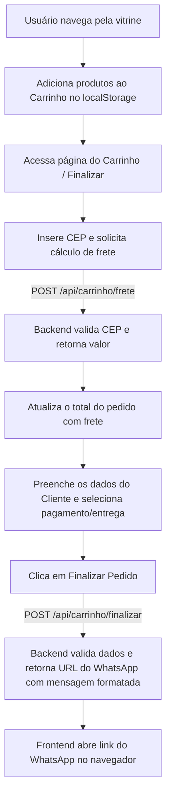

# Orquidario Yojo - Backend

Backend da vitrine virtual do Orquidario Yojo, disciplina SCC0219.

## Pre-requisitos

- Node.js 18+
- Docker Desktop instalado e rodando

NAO e necessario instalar PostgreSQL na maquina. O banco roda dentro de um container Docker.

## Setup rapido

```bash
cd backend
npm install
docker compose up -d
npm run seed:admin
npm run dev
```

Pronto. O servidor sobe em `http://localhost:3000`.

## Passo a passo detalhado

### 1. Instalar dependencias

```bash
cd backend
npm install
```

### 2. Configurar variaveis de ambiente

Copie o arquivo de exemplo:

```bash
cp .env.example .env
```

Os valores padrao ja funcionam com o Docker Compose. So altere se necessario.

| Variavel | Descricao | Padrao |
|----------|-----------|--------|
| PORT | Porta do servidor Express | 3000 |
| DB_HOST | Host do PostgreSQL | localhost |
| DB_PORT | Porta do PostgreSQL | 5432 |
| DB_NAME | Nome do banco | orquidario_yojo |
| DB_USER | Usuario do banco | postgres |
| DB_PASSWORD | Senha do banco | postgres |
| JWT_SECRET | Chave secreta do JWT | orquidario-yojo-secret-2024 |
| JWT_EXPIRES_IN | Tempo de expiracao do token | 24h |

**IMPORTANTE sobre DB_HOST:**
- `DB_HOST=localhost` porque o Node roda FORA do Docker, na sua maquina.
- Seria `DB_HOST=postgres` somente se o Node tambem estivesse dentro do Docker.
- NAO mude para `postgres` a menos que dockerize o backend tambem.

### 3. Subir o banco de dados

```bash
docker compose up -d
```

Isso cria e inicia o container `orquidario_yojo_postgres` com PostgreSQL 16. O banco `orquidario_yojo` e criado automaticamente pelo Docker.

Para verificar se o banco subiu:

```bash
docker compose ps
```

Voce deve ver o container com status `Up` e `healthy`.

Para ver os logs do banco:

```bash
docker compose logs -f postgres
```

### 4. Rodar o seeder do admin

```bash
npm run seed:admin
```

Cria o usuario administrador no banco.

Credenciais padrao:
- Email: `admin@orquidarioyojo.com.br`
- Senha: `admin123`

**Altere a senha em ambiente de producao.**

### 5. Iniciar o servidor

Desenvolvimento (com hot reload):

```bash
npm run dev
```

Producao:

```bash
npm start
```

## Scripts disponiveis

| Script | Comando | O que faz |
|--------|---------|-----------|
| `npm run dev` | `nodemon server.js` | Inicia o servidor com hot reload |
| `npm start` | `node server.js` | Inicia o servidor em producao |
| `npm run seed:admin` | `node src/seeders/...` | Cria o admin no banco |
| `npm run db:up` | `docker compose up -d` | Sobe o PostgreSQL via Docker |
| `npm run db:down` | `docker compose down` | Para o container do banco |
| `npm run db:reset` | `down -v && up -d` | Apaga o banco e recria do zero |

**Nota para Windows:** O script `db:reset` usa `&&` que funciona no PowerShell e CMD.
Se der problema, rode manualmente:

```bash
docker compose down -v
docker compose up -d
```

## Rotas disponiveis

### POST /api/auth/login

Autentica o admin e retorna um token JWT.

**Body (JSON):**

```json
{
  "email": "admin@orquidarioyojo.com.br",
  "senha": "admin123"
}
```

**Resposta (200):**

```json
{
  "user": {
    "id": 1,
    "nome": "Admin Orquidario Yojo",
    "email": "admin@orquidarioyojo.com.br"
  },
  "token": "eyJhbGciOiJIUzI1NiIs..."
}
```

### GET /api/auth/me

Retorna os dados do admin logado. Requer token.

**Header:**

```
Authorization: Bearer <token>
```

**Resposta (200):**

```json
{
  "user": {
    "id": 1,
    "nome": "Admin Orquidario Yojo",
    "email": "admin@orquidarioyojo.com.br"
  }
}
```

## Testando com Postman/Insomnia

1. Certifique-se de que o Docker esta rodando: `docker compose ps`
2. Certifique-se de que o servidor esta rodando: `npm run dev`
3. Envie **POST** `http://localhost:3000/api/auth/login` com body:
   ```json
   { "email": "admin@orquidarioyojo.com.br", "senha": "admin123" }
   ```
4. Copie o `token` da resposta
5. Envie **GET** `http://localhost:3000/api/auth/me` com header:
   ```
   Authorization: Bearer <token>
   ```
6. Deve retornar os dados do admin sem a senha


## Integração Frontend-Backend (Carrinho, Frete e WhatsApp)

Esta seção descreve como o frontend interage com o backend para gerenciar o cálculo de frete, finalização de pedidos e geração da mensagem para o WhatsApp.

### 1. Fluxo Geral da Aplicação



### 2. Endpoints e Páginas Correspondentes

| Página HTML | Evento / Ação | Endpoint | Método | Descrição |
|---|---|---|---|---|
| `carrinho.html` / `checkout.html` | Digitar CEP + clicar em "Calcular Frete" | `/api/carrinho/frete` | `POST` | Valida o CEP (8 dígitos) e retorna o frete calculado e formatado. |
| `carrinho.html` / `checkout.html` | Clicar em "Finalizar Pedido" | `/api/carrinho/finalizar` | `POST` | Recebe dados do cliente, itens e frete, valida e gera a URL e texto final do WhatsApp. |

---

### 3. Detalhes de Integração e Exemplos de `fetch()`

A URL base da API em desenvolvimento é `http://localhost:3000`.

#### A. Cálculo de Frete (`POST /api/carrinho/frete`)

**Request Body (JSON):**
```json
{
  "cep": "01310100"
}
```

**Resposta de Sucesso (200 OK):**
```json
{
  "frete": 15.00,
  "freteFormatado": "R$ 15,00"
}
```

**Exemplo de Implementação com `fetch()`:**
```javascript
async function calcularFrete(cep) {
  try {
    const response = await fetch("http://localhost:3000/api/carrinho/frete", {
      method: "POST",
      headers: {
        "Content-Type": "application/json"
      },
      body: JSON.stringify({ cep })
    });

    const data = await response.json();

    if (!response.ok) {
      alert("Erro: " + data.error);
      return;
    }

    // Salva o frete retornado no estado da tela e atualiza o DOM
    console.log("Frete:", data.frete); // 15.0
    console.log("Formatado:", data.freteFormatado); // "R$ 15,00"
  } catch (error) {
    console.error("Erro ao calcular frete:", error);
  }
}
```

---


